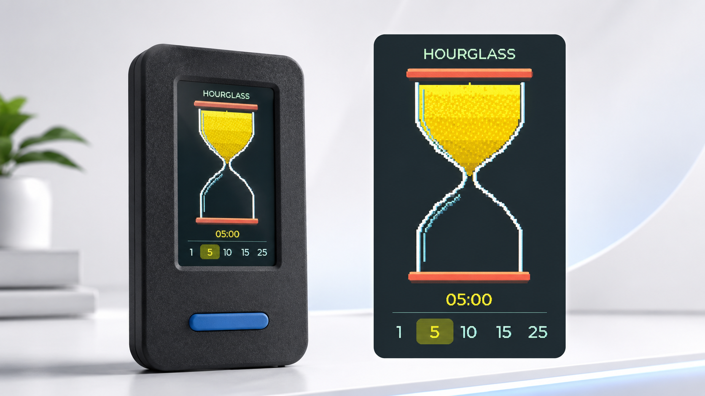
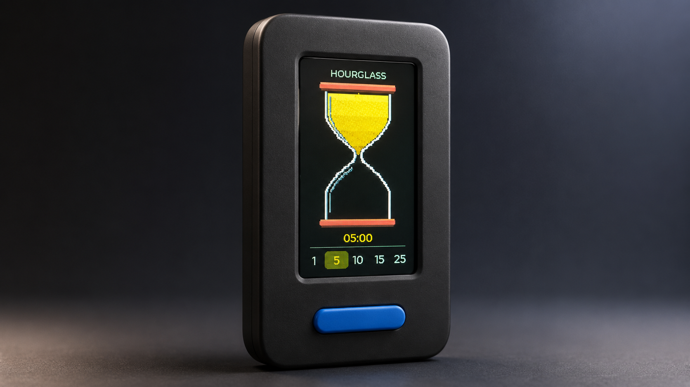

<div align="center">
  <h1>VibeStick Hourglass Liquid</h1>
  <p><strong>A pocket-sized liquid-sand hourglass for StickS3.</strong></p>
  <p>
    Fine-grained particle motion, tilt-aware gravity, flexible timers,<br>
    and a gentle completion chime on an M5Stack StickS3.
  </p>
  <p>
    <a href="#overview">Overview</a> ·
    <a href="#device-experience">Experience</a> ·
    <a href="#build--flash">Build &amp; flash</a> ·
    <a href="#controls">Controls</a> ·
    <a href="README.zh-CN.md">简体中文</a>
  </p>
  <p>
    
    
    
    
  </p>
  <br>
  
</div>

## Overview

VibeStick Hourglass Liquid turns the StickS3 into a tactile focus timer. A fixed glass frame contains 300 simulated grains that respond to device tilt, flow with the countdown, and finish settling exactly at `00:00`.

| | Capability | What it does |
| --- | --- | --- |
| **01** | Liquid-sand motion | Renders warm yellow and cyan grains with a short, natural falling stream. |
| **02** | Tilt-aware gravity | Uses filtered IMU data so the sand responds smoothly while the frame stays fixed. |
| **03** | Flexible timing | Provides `1 / 5 / 10 / 15 / 25` minute presets plus a custom-minute mode. |
| **04** | Embedded performance | Keeps physics and drawing bounded for fluid animation on the ESP32-S3. |

## Device experience

<table>
  <tr>
    <td width="50%" align="center">
      
    </td>
    <td width="50%" align="center">
      
    </td>
  </tr>
  <tr>
    <td valign="top">
      <strong>Dense liquid sand</strong><br>
      Fine grains, a restrained glow, and a droplet-like stream create depth without realtime blur or desktop-class effects.
    </td>
    <td valign="top">
      <strong>A physical focus timer</strong><br>
      Start, pause, reset, choose a duration, or flip the device using the StickS3 buttons and IMU.
    </td>
  </tr>
</table>

> [!NOTE]
> These are product concept renders. The firmware runs on the real StickS3 display at `135 × 240`; minor visual details may differ on-device.

## Before you start

- [ ] An M5Stack StickS3 and a USB-C data cable.
- [ ] ESP-IDF 5.5.x with ESP32-S3 support.
- [ ] The serial port of the connected StickS3, represented below as `<PORT>`.
- [ ] If you are updating only the hourglass app in a dual-app setup, keep the partition table and OTA data unchanged.

<p align="center"><strong>Prepare → Build → Flash → Restart → Enjoy</strong></p>

## Build & flash

### Build from source

Load ESP-IDF, then build from the repository root:

```sh
. /path/to/esp-idf/export.sh
idf.py -C firmware/sticks3 build
```

The application image is produced at:

```text
firmware/sticks3/build/vibestick_hourglass_liquid.bin
```

### Flash the verified image

The dual-app layout stores this hourglass app in the `ota_0` slot at `0x20000`. Flashing only the application image preserves the firmware in the other OTA slot:

```sh
python -m esptool --chip esp32s3 -p <port> \
  write_flash 0x20000 \
  firmware/sticks3/releases/liquid-style-v1/vibestick_hourglass_liquid.bin
```

The repository includes a [verified application image](firmware/sticks3/releases/liquid-style-v1/vibestick_hourglass_liquid.bin) and its [release notes and SHA-256](firmware/sticks3/releases/liquid-style-v1/README.md).

> [!WARNING]
> When updating only this app slot, do not rewrite the partition table or OTA data. Doing so can remove the other firmware or change the expected boot layout.

## Controls

| Input | Action |
| --- | --- |
| Front button, single click | Start or pause; after `00:00`, begin a fully reset cycle. |
| Front button, double click | Reset the timer and all particles. |
| Side button, single click | Cycle through the preset durations. |
| Side button, long press | Enter custom-minute mode. |
| Custom mode: side single / double click | Add 1 / 5 minutes. |
| Custom mode: front single / double click | Confirm / cancel. |
| Side button, triple click | Switch firmware on a dual-app device; see the [dual-firmware guide](docs/MULTI_FIRMWARE.md). |
| Rotate the device 180° | Reset and restart in the new gravity direction. |

## How it works

- Display target: `135 × 240`, portrait.
- Display refresh target: `25–30 FPS`.
- Fixed physics update: `20 Hz`.
- Particle pool: 300 fixed particles with a bounded active set.
- Collision broad phase: fixed 4-pixel uniform grid.
- Glass collision: precomputed left/right boundaries and wall normals.
- Rendering scope: only the `115 × 118` hourglass canvas is redrawn.
- Effects: fixed pixel masks; no realtime blur, filters, or full-screen buffer.
- Conservation invariant: `upper + falling + lower = total`.
- Completion feedback: soft, non-blocking three-note chime through the ES8311 codec.

Progress is the single source of truth for both time and sand transfer, so the final physical grains settle as the countdown reaches `00:00`.

## Project layout

```text
VibeStick-Hourglass-Liquid/
  README.md
  README.zh-CN.md
  docs/images/
  firmware/sticks3/
    include/
    src/
    third_party/bmi270/
    releases/liquid-style-v1/
```

## Current limits

- The firmware targets M5Stack StickS3 only.
- The checked-in binary is an application image for the repository's dual-app partition layout, not a complete factory flash image.
- The concept renders communicate the intended visual design; display color, brightness, and fine particle detail can vary on physical hardware.
- Triple-click firmware switching depends on a compatible second app being present in the other OTA slot.

## Privacy

The firmware is self-contained: it does not connect to Wi-Fi, call remote
services, record audio, or collect user data. Build artifacts can still contain
local development details, so review binaries, logs, screenshots, metadata, and
Git commit identity before publishing. See [Privacy](docs/PRIVACY.md).

## License

Original project code and documentation are available under the
[MIT License](LICENSE). Bosch BMI270 sources retain their bundled
BSD-3-Clause license; see [NOTICE](NOTICE).
